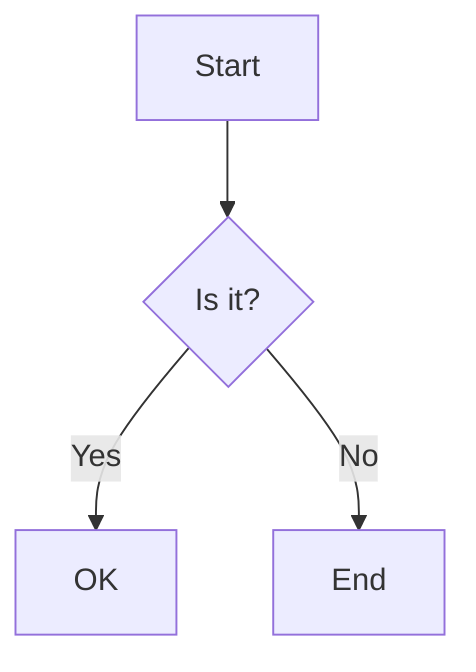

# richmd usage rules

A compact, accurate reference for authoring richmd documents and extending
richmd with your own block kinds. Written for both humans and coding
agents — every rule here is enforced by richmd's validator, not aspirational.

## The model

A richmd document is standard markdown plus a small set of **blocks**: a
fenced div (`::: {.kind attr=val}` ... `:::`) or a fenced code block
(` ```kind `). Every block has a **kind** that names its schema and
renderer. `richmd validate <file>` and `richmd render <file>` both run the
same two-phase pipeline: **validate** first (every block checked, every
error collected — never fails on just the first), **render** only if zero
errors were found. A `render` that fails writes **no output file at all**,
not a partial or stale one.

## Fenced div vs. fenced code block — read this before authoring a new kind

This distinction is load-bearing and easy to get wrong:

- **A fenced div's class is always a kind attempt.** `::: {.kind}` is
  richmd's primary authoring syntax — if `kind` isn't registered, this is a
  validation error (`unknown block kind`), not a silent pass-through.
- **A fenced code block's class is a syntax-highlighting language by
  convention, not a kind attempt.** ` ```js `, ` ```python `, ` ```bash ` —
  ordinary code samples are never touched or validated as richmd blocks.
  richmd only treats a fenced code block as one of its own blocks when the
  class is a kind it explicitly recognizes (`mermaid`, `vega-lite`, or a
  consumer-registered code-block kind). An unrecognized code-block class is
  always ordinary code.

Plain, unclassed markdown (headings, paragraphs, unclassed code fences) is
never touched or validated — richmd only ever looks at classed divs and
classed code blocks.

## The block vocabulary

### `callout` (fenced div)

```
::: {.callout tint="warning"}
Rebuilding this index takes about ten minutes.
:::
```

| Attr   | Required | Type | Allowed values              |
| ------ | -------- | ---- | --------------------------- |
| `tint` | no       | enum | `info`, `warning`, `danger` |

Body: **required**.

### `cards` (fenced div)

The workhorse enumeration block — items are `###` headings inside the div.

```
::: {.cards cols="3"}

### First card

Body text.

### Second card

Body text.
:::
```

| Attr   | Required | Type | Allowed values   |
| ------ | -------- | ---- | ---------------- |
| `cols` | no       | enum | `2`, `3`, `4`    |
| `size` | no       | enum | `sm`, `md`, `lg` |

Body: **required**.

### `stat-tile` (fenced div)

KPI-style number-plus-label. No body content — the tile's content comes
entirely from its attrs.

```
::: {.stat-tile value="42" label="widgets shipped"}
:::
```

| Attr    | Required | Type   |
| ------- | -------- | ------ |
| `value` | yes      | string |
| `label` | yes      | string |

Body: **forbidden**.

### `toc` (fenced div)

Auto-generated from the document's own headings — written empty. `richmd`
re-parses the source document to build the list, so it always matches the
real rendered heading ids (the same slug function is used for both).

```
::: {.toc max-depth="2"}
:::
```

| Attr        | Required | Type   | Meaning                                              |
| ----------- | -------- | ------ | ---------------------------------------------------- |
| `max-depth` | no       | string | heading levels to include (1–6); omit for all levels |

Body: **forbidden**.

### `labeled-block` (fenced div)

Mirrors this framework's own goal/invariant/principle-style typed
statements. The `type` attr is a free string — richmd has no opinion on
your vocabulary (`goal`, `invariant`, `decision`, whatever fits your
document).

```
::: {.labeled-block type="goal"}
**Ship the thing**

Get the feature out the door with clear scope.
:::
```

| Attr   | Required | Type   |
| ------ | -------- | ------ |
| `type` | yes      | string |

Body: **required** — conventionally a bold label line followed by prose.

### `embedded-svg` (fenced div)

Inlines a sibling `.svg` file's actual markup (a real `<svg>` element
spliced into the page, never an `` reference) — stylable via
CSS, inspectable in the page's own DOM. The `file` path is resolved
relative to the **current document's own directory**. A missing file is a
validation error naming the path; `richmd validate` catches it before
`richmd render` would ever need to.

```
::: {.embedded-svg file="diagram.svg"}
:::
```

| Attr   | Required | Type   |
| ------ | -------- | ------ |
| `file` | yes      | string |

Body: **forbidden**.

### `mermaid` (fenced code block)

Real grammar validation (not just "is this valid JSON") via mermaid's own
parser — no browser, no Puppeteer. Renders **client-side**: the raw source
is embedded and a script tag loads the mermaid.js runtime, which draws the
diagram when the page opens. Default mode references the runtime from a
CDN (the page needs network access to display the diagram); `--offline`
embeds the runtime directly instead.

````

````

No attrs. Body: **required** — must be syntactically valid mermaid source.
A malformed diagram fails validation with the parser's own line/column
error, not a generic message.

### `vega-lite` (fenced code block)

Real JSON-schema validation against vega-lite's own published schema (via
`ajv`, no browser dependency). Renders client-side via CDN-loaded
vega/vega-lite/vega-embed. Two distinct failure modes are reported: invalid
JSON vs. valid JSON that doesn't conform to the vega-lite schema.

````
```vega-lite
{
  "mark": "bar",
  "data": { "values": [{ "a": "A", "b": 28 }] },
  "encoding": {
    "x": { "field": "a" },
    "y": { "field": "b" }
  }
}
```
````

No attrs. Body: **required** — must be valid JSON conforming to the
vega-lite schema. `--offline` embeds the vega/vega-lite/vega-embed runtimes
directly in the page, the same as mermaid's own runtime; the default CDN
mode works for both.

## Cross-document links and heading anchors

Every relative link ending in `.md` (with or without a `#fragment`) is
automatically rewritten to its sibling `.html` target at render time — no
special syntax needed:

```
See [the glossary](CONTEXT.md#term-block) for the full definition.
```

- A `.md` target that doesn't exist on disk is a validation error.
- A `#fragment` that doesn't match any heading in the target document is
  **also** a validation error (checked against the target document's own
  headings, computed via the same slug function used to assign ids).
- Non-`.md` targets (external URLs, images) are never touched.

Heading ids are assigned by one documented, pure function (GitHub-flavored
rules: lowercase, punctuation stripped except hyphens, spaces to hyphens,
duplicate headings suffixed `-1`, `-2`, ...). The same function resolves
every `#fragment` link, so headings and links can never disagree.

## Extending: your own block kinds

Add a kind without forking richmd's own source. Drop a schema/renderer
pair into `.richmd/blocks/` (relative to your document's own directory):

```
.richmd/blocks/highlight.schema.json
.richmd/blocks/highlight.lua
```

`highlight.schema.json`:

```json
{
  "kind": "highlight",
  "attrs": {},
  "body": "required"
}
```

`highlight.lua`:

```lua
return {
  render = function(block, resolved_attrs)
    return pandoc.Div(block.content, pandoc.Attr("", {"my-highlight"}))
  end
}
```

The schema's `attrs`/`body` shape is identical to every built-in kind's
(see the vocabulary above). The Lua file may return either
`{ render = fn }` or a bare `render` function directly. Your kind then
validates and renders through the exact same generic pipeline as `callout`
or `mermaid` — richmd's own filter code never special-cases it. A
malformed schema file (bad JSON, missing a required field) is a **fatal,
load-time** error naming the offending file — richmd refuses to run at all
rather than silently skipping a broken extension.

## Failure behavior

Every validation error is reported as:

```
richmd: [<kind>] <location>: <reason>
```

All errors in a document are collected and printed together — richmd never
stops at the first one. A document that fails validation produces **zero**
output; a stale or partial `.html` file is never left behind.
