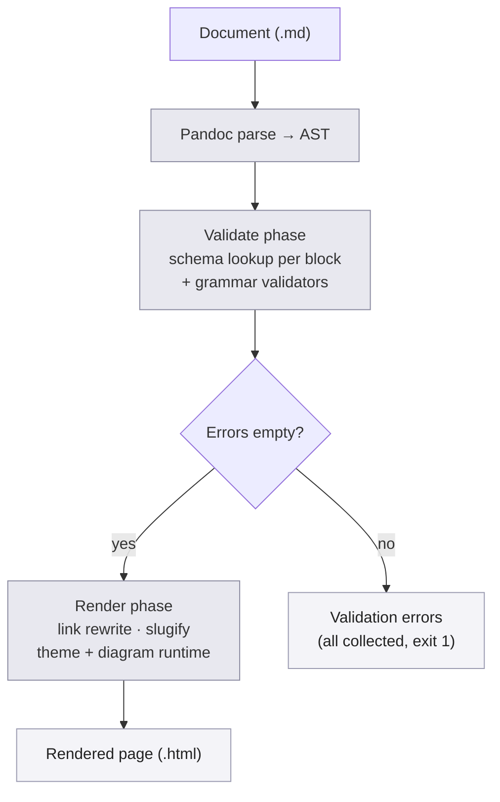

# richmd — root design

richmd turns a small set of custom markdown blocks — callouts, cards, stat
tiles, embedded diagrams and charts — into validated, themeable static HTML.
It is consumed as a CLI by other repos, never embedded as one-off scripts in
a single project. Two internal phases inside one Pandoc Lua filter: validate
first (fail closed, every error collected), render only once validation is
clean.

## 00 Foundation

:::goal
**Rich markdown, validated, to static HTML**

Convert extended-markdown [documents](CONTEXT.md#term-document) into
self-contained static HTML carrying rich visual blocks — callouts, cards,
diagrams, charts, stat tiles, embedded SVG — recognizable to anyone who
already writes markdown.
:::

:::goal
**Fail closed, before ever writing output**

A malformed [block](CONTEXT.md#term-block) — wrong attrs, invalid mermaid or
vega-lite grammar, a dangling cross-document link — never reaches rendered
output. Every [validation error](CONTEXT.md#term-validation-error) in the
document is collected and reported with a clear, per-block reason before
any HTML is written.
:::

:::goal
**Consumable as a dependency, not copy-pasted scripts**

Any repo pulls richmd in as a pinned, reproducible package — via its Nix
flake or the npm wrapper — and runs it as a CLI. See
[ADR-0001](../adr/0001-nix-flake-primary-npm-thin-wrapper.md#adr-0001).
:::

:::goal
**Extend without forking**

A consumer adds its own [block kind](CONTEXT.md#term-block-kind) — schema
plus renderer — without touching richmd's core source. See
[ADR-0003](../adr/0003-schema-lua-plugin-pair-for-extension.md#adr-0003).
:::

:::no-goal
**Not a static site generator**

No navigation, search, or multi-page site scaffolding beyond what
[cross-document link](CONTEXT.md#term-cross-document-link) rewriting gives
for free. One document in, one page out — a single render call never
orchestrates or walks a whole tree. The
[in-tree link marker](CONTEXT.md#term-in-tree-link) (§06) narrows this
without crossing it: it only changes how links already being rewritten in
that one render are classified, never adds a second document to the call.
See [ADR-0005](../adr/0005-tree-flag-for-in-tree-link-classification.md#adr-0005).
:::

:::no-goal
**Not a WYSIWYG editor**

richmd converts markdown text a human or agent already wrote; it never
provides an authoring UI.
:::

:::no-goal
**Not a hosting or publishing tool**

richmd's job ends at a written `.html` file on disk. Deploying, serving, or
publishing it is the consumer's concern.
:::

:::no-goal
**Not a semantic validator for diagrams/charts**

[Grammar validators](CONTEXT.md#term-grammar-validator) check that mermaid
and vega-lite source is syntactically well-formed. They do not check that a
vega-lite spec references fields that actually exist in its data, or that a
mermaid diagram's logic makes domain sense.
:::

:::invariant {enforcement=mechanism script=richmd-filter-core lens=robustness}
**Fail-closed gate**

A [document](CONTEXT.md#term-document) that fails the
[validate phase](CONTEXT.md#term-validate-phase) never reaches the
[render phase](CONTEXT.md#term-render-phase). The filter's own control flow
gates on an empty error list — there is no path from a non-empty error list
to a written `.html` file.
:::

:::invariant {enforcement=mechanism script=richmd-filter-core lens=invariants}
**Schema-driven validation, no hardcoded kinds**

Every [block](CONTEXT.md#term-block) — built-in or consumer-extended — is
checked against its
[block kind schema](CONTEXT.md#term-block-kind-schema) in the
[registry](CONTEXT.md#term-block-kind-registry). The validator's core loop
reads the registry generically; extending the vocabulary means adding a
schema entry, never adding an `if kind == "x"` branch.
:::

:::invariant {enforcement=mechanism script=richmd-filter-core lens=robustness}
**All errors collected, never fail-fast on the first**

The [validate phase](CONTEXT.md#term-validate-phase) accumulates every
[validation error](CONTEXT.md#term-validation-error) in the document before
reporting or exiting — never an early return on the first problem found.
:::

:::invariant {enforcement=mechanism script=richmd-filter-core lens=robustness}
**Cross-document links always resolve**

Every relative [cross-document link](CONTEXT.md#term-cross-document-link) is
checked against the filesystem during the
[validate phase](CONTEXT.md#term-validate-phase); a target that does not
resolve to an existing source file is a
[validation error](CONTEXT.md#term-validation-error), never a silently
broken link in the output.
:::

:::invariant {enforcement=mechanism script=richmd-filter-core lens=state}
**Slugs are a pure, documented function**

A heading's [slug](CONTEXT.md#term-slug) is computed by one documented,
tested function of its text (GitHub-flavored rules). The same function
resolves every `#fragment` link, so headings and links can never disagree.
:::

:::principle {id=P1 lens=invariants}
**Mechanize the decidable**

A rule a machine can check belongs in the
[block kind schema](CONTEXT.md#term-block-kind-schema) and the validator,
never in author convention or documentation prose.
:::

:::principle {id=P2 lens=robustness}
**Fail loud, local, and early**

A malformed block's error names the block, its location, and the reason, at
[validate-phase](CONTEXT.md#term-validate-phase) time — never a downstream
rendering crash or a silently wrong page.
:::

:::principle {id=P3 lens=composition}
**Style is swappable, never hardcoded**

The renderer emits structure and `--richmd-*` CSS-variable hooks; visual
identity lives entirely in the [theme](CONTEXT.md#term-theme) stylesheet,
never in generator logic.
:::

:::principle {id=P4 lens=composition}
**Extend by composition, never by fork**

A consumer adds a [block kind](CONTEXT.md#term-block-kind) through the
[extension directory](CONTEXT.md#term-extension-directory)'s schema + Lua
pair. Modifying richmd's own core source is never the extension path. See
[ADR-0003](../adr/0003-schema-lua-plugin-pair-for-extension.md#adr-0003).
:::

## 01 System at a glance

richmd is one pipeline: parse, validate, gate, render. The
[validate phase](CONTEXT.md#term-validate-phase) and
[render phase](CONTEXT.md#term-render-phase) are two internal phases of one
Lua filter — not two Pandoc invocations. See
[ADR-0002](../adr/0002-one-filter-two-internal-phases.md#adr-0002).



:::info {title="Reading the pipeline"}
One invocation, one parse. The diamond is the fail-closed gate
([invariant](#00-foundation)): only an empty error list reaches the render
phase. Both branches terminate the same filter run — there is no retry loop
inside richmd itself.
:::

## 02 CLI entry {#02-cli-entry}

:::cards {cols=2}

### `richmd validate <file>` `lens:robustness`

**Run the gate without writing output.** Invokes the same Lua filter, passes
a flag that stops execution right after the
[validate phase](CONTEXT.md#term-validate-phase). Exits 0 clean, 1 on
collected [validation errors](CONTEXT.md#term-validation-error) printed to
stderr, never touches disk beyond reading input. Built for CI/pre-commit
gates that should not produce discardable build artifacts.

### `richmd render <file> [--offline] [--tree=<path>...]`

**Run the full pipeline.** Same filter, both phases. `--offline` switches
the [render phase](CONTEXT.md#term-render-phase) into
[offline bundling](CONTEXT.md#term-offline-bundling): downloads and embeds
the pinned diagram-runtime JavaScript instead of leaving CDN references.
Repeatable `--tree=<path>` names sibling `.md` paths that count as
[in-tree](CONTEXT.md#term-in-tree-link) for link classification (literal
paths only — richmd does no glob-expansion; the shell or caller expands
globs before argv). Writes the sibling `.html` file only when the validate
phase collects zero errors.
:::

## 03 Filter core {#03-filter-core}

**Owns the two-phase orchestration.** One Lua filter module, loaded by
Pandoc, walks the document's AST once. Its own control flow is the
fail-closed gate: the render pass is unreachable code unless the validate
pass's error list is empty.

- **Responsibility**: sequence validate-then-render inside a single AST
  walk; own the phase boundary itself.
- **Interface**: invoked by the CLI (§02) via `pandoc --lua-filter`; consumes
  a [document](CONTEXT.md#term-document) path and the `--offline` flag;
  produces either a [rendered page](CONTEXT.md#term-rendered-page) or a
  non-zero exit with printed
  [validation errors](CONTEXT.md#term-validation-error).
- **Interacts with**: the [block kind registry](#04-block-kind-registry) for
  per-block schema lookup; the
  [grammar validators](#05-grammar-validators) via shell-out for
  mermaid/vega-lite blocks; the
  [link resolver and slugifier](#06-link-resolver-and-slugifier) during the
  render pass; the [theme and diagram runtime](#07-theme-and-diagram-runtime)
  component for the final HTML injection.
- **Invariants held**: fail-closed gate, all-errors-collected (both §00).
- **Failure behavior**: any Lua runtime error during either phase is a hard
  filter failure — printed with the block location that triggered it,
  non-zero exit, no partial HTML written.

## 04 Block kind registry {#04-block-kind-registry}

**Owns schema lookup for every block kind, built-in or extended.** A single
table keyed by kind name; each entry is a
[block kind schema](CONTEXT.md#term-block-kind-schema) (required/optional
attrs, allowed values, body shape) plus its Lua render function.

- **Responsibility**: load richmd's built-in schemas (callout, cards, stat
  tile, stat grid, TOC, labeled block, embedded SVG) and merge in every
  schema found under the consumer's
  [extension directory](CONTEXT.md#term-extension-directory)
  (`.richmd/blocks/` by default); resolve a block's kind name to its schema
  and renderer for both filter phases.
- **Interface**: `lookup(kind_name) -> {schema, render_fn} | nil`; for a
  [Block](CONTEXT.md#term-block) whose class is always a kind attempt (a
  fenced div), a missing kind is itself a
  [validation error](CONTEXT.md#term-validation-error), never a silent
  pass-through — a fenced code block's unrecognized class is ordinary code,
  not a validation error, per the Block term's own distinction.
- **Interacts with**: the [filter core](#03-filter-core), which calls
  `lookup` once per block during validate and again during render; consumer
  repos, which populate the extension directory.
- **Invariants held**: schema-driven validation (§00) — this is the table
  the invariant's "generic lookup, no hardcoded kinds" claim depends on.
- **Failure behavior**: a schema fragment that itself fails to parse (bad
  JSON, missing required schema fields) is a load-time error naming the
  offending file — the filter refuses to run rather than silently skipping
  a broken extension.

:::cards {cols=3 size=sm}

### callout

info/warning/danger tinted panels

### cards / grid

the workhorse enumeration block, each card's `###` title optionally paired
with a small badge/tag (e.g. `client`, `owns: schema registry`) — visual
metadata, never a substitute for the title text itself

### stat tile

KPI-style number-plus-label

### stat grid

groups sibling stat tiles into one shared row

### TOC

auto-generated from headings

### labeled block

goal/invariant/principle-style typed statement

### embedded SVG

inline a sibling `.svg` file, with an optional caption rendered as a real
`<figure>`/`<figcaption>` pair

### chart

`{type=bar|line|pie}` convenience block: a markdown table expands to a
[vega-lite spec](#term-chart-expansion) — see §04.1
:::

### 04.1 Chart expansion {#04-1-chart-expansion}

**Owns table-to-vega-lite expansion for the `chart` built-in kind.** The
only built-in kind whose Lua render function emits a different block kind's
source (a ` ```vega-lite ` fenced block) rather than final HTML directly —
composition, not a special case: the expanded spec re-enters the same
[grammar validator](#05-grammar-validators) and
[diagram runtime](#07-theme-and-diagram-runtime) every hand-authored
vega-lite block already goes through.

- **Responsibility**: read the block's markdown-table body and `type` attr;
  bind the table's first column to the `x`/category encoding and the second
  to the `y`/value encoding by position, unless `x=`/`y=` attrs name header
  columns explicitly (required once the table carries more than two
  columns); emit a minimal vega-lite spec of the requested mark type. Every
  mark type carries a color channel keyed to the category field — the
  [categorical palette](CONTEXT.md#term-categorical-palette) supplies the
  actual colors at render time, so expansion itself stays color-agnostic.
- **Interface**: `expand(attrs, table_rows) -> vega_lite_json | validation_error`,
  called during the [validate phase](CONTEXT.md#term-validate-phase) before
  the expanded spec is handed to `vega-lite-check.js` (§05) exactly like any
  other vega-lite block.
- **Interacts with**: the [block kind registry](#04-block-kind-registry),
  which dispatches `chart` blocks here instead of straight to HTML; the
  [grammar validators](#05-grammar-validators), which validate the expanded
  output; the [theme and diagram runtime](#07-theme-and-diagram-runtime),
  which renders it identically to a hand-authored chart.
- **Invariants held**: schema-driven validation (§00) — a `chart` block with
  more than two columns and no explicit `x=`/`y=` binding is a
  [validation error](CONTEXT.md#term-validation-error) naming the ambiguity,
  never a guessed encoding.
- **Failure behavior**: an unresolvable column binding, or a `type` outside
  `bar|line|pie`, is a validate-phase
  [validation error](CONTEXT.md#term-validation-error) naming the block; a
  table too wide for positional binding is rejected before expansion is
  attempted, never silently truncated to two columns.

## 05 Grammar validators {#05-grammar-validators}

**Owns real grammar checking for mermaid and vega-lite.** Neither has a
native Lua grammar library, so each gets a small, tightly-scoped Node.js
helper script the filter shells out to — not the full mermaid-cli/Puppeteer
stack.

- **Responsibility**: given one fenced code block's source text, return
  either "valid" or a structured error (line, column, reason) without
  rendering anything to a picture.
- **Interface**: two standalone scripts, `mermaid-check.js` (calls
  `mermaid.parse(source)` headless — no DOM, no browser) and
  `vega-lite-check.js` (validates against the vega-lite JSON schema);
  invoked as a subprocess per block, communicating over stdin/stdout as
  JSON.
- **Interacts with**: the [filter core](#03-filter-core)'s validate phase,
  once per mermaid or vega-lite block found.
- **Invariants held**: contributes to schema-driven validation (§00) for the
  two block kinds no Lua grammar exists for.
- **Failure behavior**: a malformed diagram/chart is a
  [validation error](CONTEXT.md#term-validation-error) naming the block and
  the parser's own reason; a validator subprocess crashing unexpectedly is
  itself a hard filter failure, distinct from a normal grammar rejection.

:::warning {title="What this does not catch"}
Syntax-only. A mermaid diagram that parses cleanly but references an
unsupported layout feature, or a vega-lite spec whose grammar is valid but
whose field references do not exist in its data, passes this gate — see the
"not a semantic validator" no-goal (§00).
:::

## 06 Link resolver and slugifier {#06-link-resolver-and-slugifier}

**Owns cross-document link rewriting and heading-anchor stability.** Two
related passes during the render phase, both grounded in the same
filesystem/AST walk the validate phase already did.

- **Responsibility**: rewrite every relative `.md` link target (with or
  without a `#fragment`) to its sibling `.html` target, automatically, with
  no special marker syntax required to make rewriting itself work; assign
  every heading a [slug](CONTEXT.md#term-slug) via the documented pure
  function; when `--tree` (§02) is present, classify each rewritten link as
  [in-tree](CONTEXT.md#term-in-tree-link) by comparing its resolved `.md`
  path (fragment stripped) against the flag's path set.
- **Interface**: a link-rewrite pass and a slugify pass, both operating on
  the Pandoc AST during the render phase; the slugify function is also
  exported standalone so `#fragment` link resolution during validate can
  call the identical logic. The link-rewrite pass additionally emits
  `class="richmd-intree-link"` on a rewritten `<a>` when `--tree` is present
  and the target matches — no class, and identical output to today, when
  `--tree` is absent.
- **Interacts with**: the [filter core](#03-filter-core)'s render phase;
  every [document](CONTEXT.md#term-document) a consumer's corpus links
  between.
- **Invariants held**: cross-document links always resolve, slugs are a
  pure documented function (both §00).
- **Failure behavior**: a link target that fails to resolve to an existing
  source file was already caught at validate time (§00 invariant) — by
  render time this pass only rewrites and classifies, never discovers new
  failures. A `--tree` path that does not match any link in the document is
  not an error — silently unused, exactly like an unmatched glob would be.

## 07 Theme and diagram runtime {#07-theme-and-diagram-runtime}

**Owns the visual identity and how diagrams/charts actually become
pictures.** Two closely related concerns: the CSS asset, and how mermaid/
vega-lite source becomes a rendered visual in the reader's browser.

- **Responsibility**: inject one default stylesheet (built from
  `--richmd-*` CSS custom properties) into every
  [rendered page](CONTEXT.md#term-rendered-page); embed each mermaid/
  vega-lite block's raw source in a runtime-recognizable container
  (`<pre class="mermaid">` and equivalent) so the diagram renders
  client-side on page load, never at build time. A diagram's own colors
  are read from the page's live `--richmd-*` custom properties at render
  time (via `getComputedStyle`), never hardcoded — so a diagram matches
  whatever theme (default or a consumer's reskin) is active, and
  re-renders when the theme toggle (§00) flips light/dark, exactly like
  the surrounding page's own colors do. A [categorical
  palette](CONTEXT.md#term-categorical-palette) of six `--richmd-color-cat-*`
  tokens is read the same live way and injected as every Vega-Lite spec's
  default color range — chart-derived or hand-authored alike, since both
  reach the shared base config identically — with an author's own explicit
  `scale.range` still winning. See
  [ADR-0007](../adr/0007-shared-categorical-palette-for-vega-lite-specs.md#adr-0007).
- **Interface**: default mode emits CDN `<script>` tags for the mermaid.js
  and vega-lite runtimes; `--offline` (§02) downloads the pinned versions
  once and embeds them directly in the page instead. Container width is a
  per-document choice, authored as a YAML frontmatter key
  (`richmd-layout: narrow`, defaulting to `wide` when absent) — a
  data-heavy report reads better wide, a prose-heavy document can opt into
  the narrower reading column.
- **Interacts with**: the [filter core](#03-filter-core)'s render phase for
  injection; a consumer's own CSS file, which overrides `--richmd-*`
  variables or replaces the stylesheet wholesale to reskin.
- **Invariants held**: style is swappable (§00 principle P3) — the
  generator never hardcodes a visual identity, only the variable contract.
- **Failure behavior**: a diagram that fails to parse client-side (a gap the
  syntax-only validator missed, or a mermaid version mismatch between
  validate-time and the CDN-served runtime) fails visibly in the reader's
  browser console — not richmd's own failure surface, but a known seam
  worth naming.

:::info {title="CDN default, offline opt-in"}
The default [rendered page](CONTEXT.md#term-rendered-page) needs network
access to display diagrams and charts — an explicit, named trade-off, not a
silent one. See
[ADR-0004](../adr/0004-cdn-default-offline-bundling-opt-in.md#adr-0004).
:::

## 08 CI {#08-ci}

**Owns proving the gate on every push, not just on the author's machine.**
CI runs a strict superset of what [lefthook](https://github.com/lostbean/richmd/blob/main/lefthook.yml)
runs locally: every check lefthook's pre-commit hook runs (format, the design
gate), plus the slower checks a pre-commit hook can't afford to block a
commit on (the full test suite, the Nix build, the example-doc regression
checks, the theme-swap proof). A contributor's local "green" from lefthook is
never contradicted by CI — it just isn't the whole story until CI's own
slower checks have run too.

- **Responsibility**: run `nix flake check` (formatting plus any flake
  checks), the full test suite for every deep module (filter core, block
  kind registry, grammar validators, link resolver/slugifier, theme/diagram
  runtime), the design gate
  (`scripts/design-render --check` on every `design.md`,
  `scripts/layer-integrity .`), and the example-doc regression check
  (`examples/` — render the golden example, diff its output hash against
  the committed one; a mismatch fails the build, since output only changes
  on a deliberate markup/theme change, never silently) on every push and
  pull request.
- **Interface**: a GitHub Actions workflow, using the repo's own
  [flake.nix](https://github.com/lostbean/richmd/blob/main/flake.nix)
  devShell so CI's toolchain versions can never drift from a contributor's
  local `nix develop` shell.
- **Interacts with**: every component in §02–§07 (it runs their tests) and
  the design layer itself (it runs the design gate).
- **Invariants held**: none new — CI is the mechanism that keeps the
  fail-closed gate (§00) and schema-driven validation (§00) provably true on
  every change, not just locally.
- **Failure behavior**: any red check blocks a pull request from being
  considered mergeable; CI never soft-fails or skips a channel the local
  gate runs.

## 09 End-to-end walkthrough

**Scenario: an author renders a design document, then fixes a broken
diagram.**

1. An author edits `docs/design/design.md` in a consumer repo. It contains a
   callout, a cards grid, a mermaid flowchart, and a link to
   `CONTEXT.md#term-something`.
2. They run `richmd render docs/design/design.md`.
3. The CLI (§02) invokes Pandoc with richmd's Lua filter. The
   [filter core](#03-filter-core) parses the document once and enters the
   [validate phase](CONTEXT.md#term-validate-phase): every block is looked
   up in the [registry](#04-block-kind-registry); the mermaid block is
   shelled out to the [grammar validator](#05-grammar-validators); the
   `CONTEXT.md` link target is checked against the filesystem.
4. Zero errors collected. The gate (§01 diamond) admits the
   [render phase](CONTEXT.md#term-render-phase): the
   [link resolver](#06-link-resolver-and-slugifier) rewrites the `.md` link
   to `.html`, headings get their [slugs](CONTEXT.md#term-slug), the
   [theme](#07-theme-and-diagram-runtime) stylesheet and CDN script tags are
   injected.
5. `design.html` is written; the CLI exits 0.

**Second beat — the same document, but the mermaid block now has a typo in
an arrow syntax.**

6. The author reruns `richmd render docs/design/design.md`.
7. The [grammar validator](#05-grammar-validators) rejects the block;
   the [filter core](#03-filter-core) still finishes walking the rest of the
   document, collecting any further errors alongside it.
8. The validate phase's error list is non-empty. The gate blocks the render
   phase entirely — no `design.html` is written, not even a stale one.
9. The CLI exits 1, printing every collected error with its block's
   location and reason — the mermaid typo, named precisely, and nothing
   else silently wrong elsewhere in the same document.
