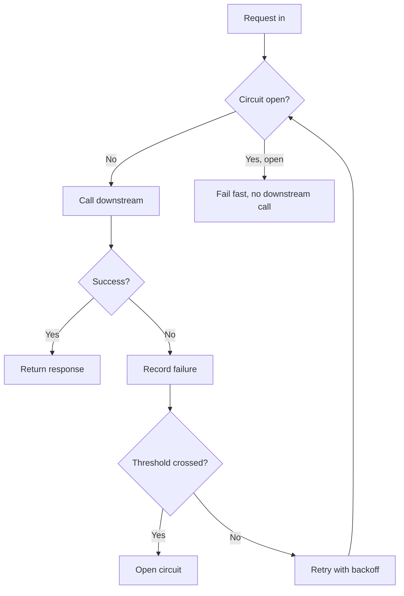

# Distributed Systems Terms Used in This Report

This report uses a custom theme (`examples/custom-theme.css`) and a custom
`definition` block extension (`examples/.richmd/blocks/definition.*`) to show
richmd's reskinning and extension mechanisms working together. The theme is
a complete, drop-in replacement for `theme/default.css` — same `--richmd-*`
variable names and `.richmd-*` class selectors, entirely different values
(warm paper background, forest-green/amber accents, serif display type) —
and it is never referenced from this markdown source. richmd's CLI has no
"pick a theme" flag; the reskin is proven separately, after render, by
swapping the embedded `<style>` block's content in the rendered HTML (see
`scripts/theme-swap-check`). The `definition` kind, by contrast, IS resolved
at render time, from this document's own `.richmd/blocks/` directory — the
same generic extension mechanism the `kicker` kind in
[the platform status report](data-status-report.md) uses, applied to a
genuinely different, useful block: a glossary-entry panel with the term set
as a bold heading and the definition as body text.

::: {.toc max-depth="2"}
:::

## Why a shared vocabulary matters

::: {.callout tint="info" title="How to read this report"}
Each numbered section below covers one cluster of related terms. Terms are
defined using the custom `definition` block; supporting concepts and
worked examples use richmd's built-in `callout` and `cards` blocks so this
document also exercises the ordinary built-in vocabulary alongside the new
extension.
:::

Distributed systems terminology is inconsistently used across teams and
vendors — "eventual consistency" means something different to a database
engineer than to a CDN operator. This reference pins down the specific
terms this organization's platform documentation relies on, so incident
reports, design docs, and onboarding material can all point at the same
definitions instead of re-explaining them inline.

## Consistency and correctness

::: {.definition term="Idempotency key"}
A client-generated identifier attached to a request so that retrying the
same request — after a timeout, a dropped connection, or a client-side
crash — is applied **at most once** on the server, no matter how many
times the request is resent. The server stores a short-lived record of
keys it has already processed and returns the original response instead of
re-executing the operation for a repeated key.
:::

::: {.definition term="Eventual consistency"}
A consistency model in which, once writes to a piece of data stop
arriving, all replicas of that data will converge to the same value given
enough time — but at any given moment, a read from one replica may return
a value different from a concurrent read against another replica. Trades
strict ordering guarantees for higher availability and lower write
latency.
:::

::: {.definition term="Quorum"}
The minimum number of replicas that must acknowledge a read or write
operation before the operation is considered successful. In an N-replica
system, requiring `W` replicas to acknowledge a write and `R` replicas to
acknowledge a read, with `W + R > N`, guarantees every read overlaps with
every prior write on at least one replica — the basis for
"read-your-writes" guarantees without requiring all N replicas to
respond.
:::

::: {.callout tint="warning" title="Quorum overlap is necessary, not sufficient"}
Satisfying `W + R > N` guarantees a _replica-set_ overlap between a read
and a prior write, but does not by itself guarantee the read observes the
_most recent_ write if writes themselves can be concurrent and
unordered — that additional guarantee requires versioning (e.g. vector
clocks or a monotonic timestamp) on top of the quorum overlap.
:::

## Failure handling

::: {.definition term="Circuit breaker"}
A stateful guard placed in front of a call to a potentially failing
downstream dependency. It tracks recent failure rate and, once failures
cross a threshold, "opens" — failing new calls immediately, without
attempting the downstream call at all — for a cooldown period, then allows
a small number of trial calls through to test whether the dependency has
recovered before fully "closing" again.
:::

::: {.definition term="Retry storm"}
A cascading failure pattern in which a downstream dependency's temporary
slowdown causes callers to time out and retry, multiplying the request
volume the dependency receives at the exact moment it is least able to
handle load — often turning a brief degradation into a prolonged outage.
Bounded retry budgets and circuit breakers are the standard mitigations.
:::

The diagram below shows how these two mechanisms compose: a circuit
breaker sits between the retry logic and the downstream call, so a
already-degraded dependency stops receiving retried traffic instead of
being buried under it.

## Reference: mitigation patterns

::: {.cards cols="3"}

### Retry budget

Caps the fraction of a service's outbound calls that may be retries,
shared across all callers rather than allowing each request its own
unbounded backoff — the direct mitigation for a retry storm.

### Bulkhead isolation

Partitions a limited resource (thread pool, connection pool) into
isolated segments per downstream dependency, so one dependency's
slowdown cannot exhaust the resource pool shared by calls to healthy
dependencies.

### Graceful degradation

Serves a reduced but still-useful response (cached data, a default
value, a partial result) when a non-critical dependency is unavailable,
rather than failing the entire request.
:::

## Summary

::: {.definition term="Fail closed"}
A design stance in which, when a system cannot determine whether an
operation is safe, it defaults to rejecting or halting the operation
rather than allowing it to proceed — the opposite of "fail open," which
defaults to permitting the operation. Preferred whenever the cost of a
false negative (blocking a safe operation) is lower than the cost of a
false positive (allowing an unsafe one through).
:::

These terms recur across this organization's incident postmortems and
platform design docs; treat this page as the canonical definition source
rather than re-deriving definitions inline elsewhere.
