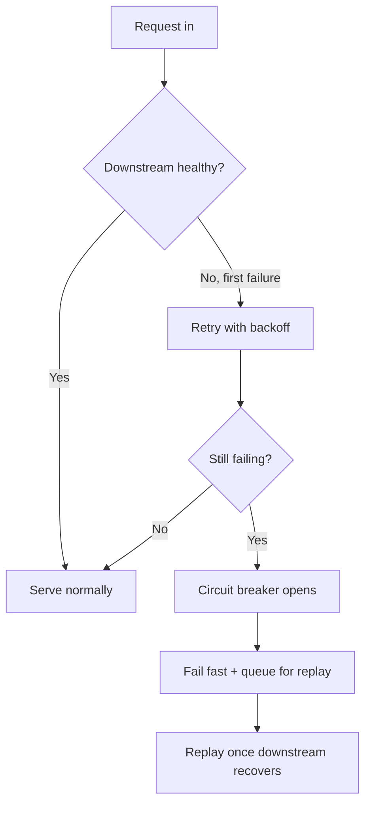

# Q2 Platform Status

::: {.kicker}
INTERNAL — PLATFORM ENGINEERING
:::

A quarterly look at platform health, reliability, and the work that shaped
it. This report covers April through June: uptime, latency, incident load,
and where the team is spending its time going into Q3.

::: {.toc max-depth="2"}
:::

## Headline numbers

::: {.stat-tile value="99.97%" label="uptime this quarter" delta="↑ 0.04 pts vs Q1" dir="up"}
:::

::: {.stat-tile value="142ms" label="p50 API latency" delta="↓ 18ms vs Q1" dir="up"}
:::

::: {.stat-tile value="6" label="sev-1 incidents" delta="↑ 2 vs Q1" dir="down"}
:::

::: {.stat-tile value="4.2M" label="requests / day (avg)"}
:::

::: {.callout tint="warning" title="Watch item"}
Sev-1 incidents ticked up this quarter, concentrated in the billing
webhook path (see [Reliability](#reliability) below). The root-cause
fixes are scoped for early Q3 — tracked as the top reliability priority
going into next quarter.
:::

## Reliability

::: {.kicker}
INCIDENTS & UPTIME
:::

Five of the six sev-1s traced back to retry storms against a downstream
payments provider during its own degraded periods; the sixth was a bad
config push to the edge cache layer that was reverted within nine minutes.
Both failure classes now have dedicated mitigation work queued.



The chart below tracks sev-1 count per month against our quarterly budget
of two per month — April and May came in under budget; June's spike is the
retry-storm cluster described above.

```vega-lite
{
  "$schema": "https://vega.github.io/schema/vega-lite/v6.json",
  "description": "Sev-1 incidents per month vs. budget",
  "data": {
    "values": [
      { "month": "Apr", "incidents": 1, "budget": 2 },
      { "month": "May", "incidents": 1, "budget": 2 },
      { "month": "Jun", "incidents": 4, "budget": 2 }
    ]
  },
  "mark": "bar",
  "encoding": {
    "x": { "field": "month", "type": "ordinal", "sort": null, "title": "Month" },
    "y": { "field": "incidents", "type": "quantitative", "title": "Sev-1 incidents" },
    "color": {
      "condition": { "test": "datum.incidents > datum.budget", "value": "#dc2626" },
      "value": "#4f46e5"
    }
  }
}
```

## What shipped

::: {.kicker}
Q2 DELIVERY
:::

::: {.cards cols="3"}

### Retry budget enforcement

Downstream calls now carry a shared retry budget instead of per-request
unbounded backoff — the mechanism directly responsible for containing
what would otherwise have been a seventh sev-1 in late June.

### Read-replica autoscaling

The read path now scales replica count off real query latency rather than
a fixed schedule, cutting p50 API latency by 18ms quarter over quarter.

### Config push canarying

Edge cache config changes now roll out to a single canary region first
and auto-revert on an error-rate spike, the direct fix for the June
config-push incident.
:::

## Operating principles

::: {.kicker}
HOW WE DECIDE
:::

::: {.labeled-block type="principle"}
**Fail closed, not open**

When a downstream dependency is unhealthy, the platform must degrade to a
safe, explicit failure rather than silently serving stale or incorrect
data.
:::

::: {.labeled-block type="invariant"}
**Every sev-1 gets a mitigation, not just a postmortem**

A sev-1 incident review is not considered closed until at least one
concrete mitigation (a code change, an alert, or a runbook update) has
shipped — a retrospective alone is not sufficient.
:::

## Trend at a glance

::: {.embedded-svg file="diagram.svg"}
:::

## Incident detail

Full sev-1 log for the quarter (6 incidents):

| Date   | Duration | Cause                         | Mitigation               |
| ------ | -------- | ----------------------------- | ------------------------ |
| Apr 08 | 22 min   | Payments provider degradation | Retry budget enforcement |
| Apr 25 | 14 min   | Payments provider degradation | Retry budget enforcement |
| May 12 | 31 min   | Payments provider degradation | Retry budget enforcement |
| Jun 03 | 9 min    | Bad edge cache config push    | Config push canarying    |
| Jun 14 | 41 min   | Payments provider degradation | Retry budget enforcement |
| Jun 22 | 19 min   | Payments provider degradation | Retry budget enforcement |

## Looking ahead to Q3

Reliability work carries forward as the top priority: the payments-provider
retry-storm fixes above should collapse five of this quarter's six sev-1s
into near-zero incidents once fully rolled out. Latency work shifts focus
to the write path next, where p50 has been flat while the read path
improved.
