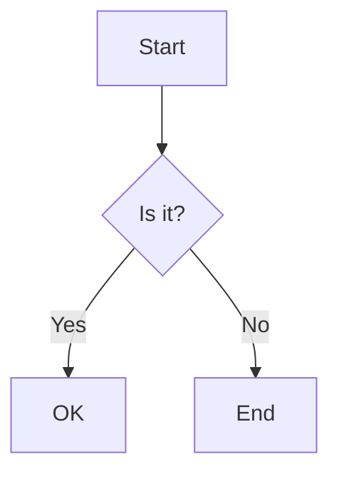

::: {.callout tint="info"}
This is a valid callout body.
:::



```vega-lite
{
  "$schema": "https://vega.github.io/schema/vega-lite/v6.json",
  "data": {"values": [{"a": "A", "b": 28}, {"a": "B", "b": 55}, {"a": "C", "b": 43}]},
  "mark": "bar",
  "encoding": {
    "x": {"field": "a", "type": "nominal"},
    "y": {"field": "b", "type": "quantitative"}
  }
}
```
